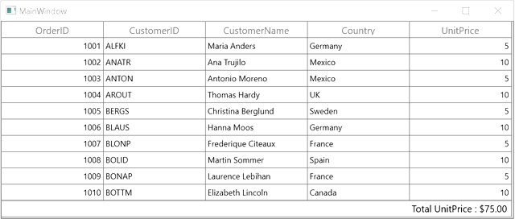

# How to Update the Table Summary Value When the Cell in Edit Mode in WPF DataGrid?

This sample illustrates how to update the table summary value when the cell in edit mode in [WPF DataGrid](https://www.syncfusion.com/wpf-controls/datagrid) (SfDataGrid).

In `DataGrid`, you can update the summary values when you are changing the value by overriding `OnInitializeEditElementmathod` and `UiElement.ValueChanging` event in [GridNumericCellRenderer](https://help.syncfusion.com/cr/wpf/Syncfusion.UI.Xaml.Grid.Cells.GridCellNumericRenderer.html).

#### C#
```c#
dataGrid.LiveDataUpdateMode = LiveDataUpdateMode.AllowSummaryUpdate;

this.dataGrid.CellRenderers.Remove("Numeric");
this.dataGrid.CellRenderers.Add("Numeric", new CustomizedGridCellNumericRenderer(dataGrid));

internal class CustomizedGridCellNumericRenderer : GridCellNumericRenderer
{
    RowColumnIndex RowColumnIndex;

    SfDataGrid DataGrid { get; set; }

    string newvalue = null;

    public CustomizedGridCellNumericRenderer(SfDataGrid dataGrid)
    {
        DataGrid = dataGrid;
    }

    public override void OnInitializeEditElement(DataColumnBase dataColumn, DoubleTextBox uiElement, object dataContext)
    {
        base.OnInitializeEditElement(dataColumn, uiElement, dataContext);
        uiElement.ValueChanging += UiElement_ValueChanging;
        this.RowColumnIndex.ColumnIndex = dataColumn.ColumnIndex;
        this.RowColumnIndex.RowIndex = dataColumn.RowIndex;
    }

    private void UiElement_ValueChanging(object sender, Syncfusion.Windows.Shared.ValueChangingEventArgs e)
    {
        newvalue = e.NewValue.ToString();
        UpdateSummaryValues(this.RowColumnIndex.RowIndex, this.RowColumnIndex.ColumnIndex);
    }

    private void UpdateSummaryValues(int rowIndex, int columnIndex)
    {
        string editEelementText = newvalue=="0" ? "0" : newvalue;
        columnIndex = this.DataGrid.ResolveToGridVisibleColumnIndex(columnIndex);
        if (columnIndex < 0)
            return;

        var mappingName = DataGrid.Columns[columnIndex].MappingName;
        var recordIndex = this.DataGrid.ResolveToRecordIndex(rowIndex);

        if (recordIndex < 0)
            return;

        if (DataGrid.View.TopLevelGroup != null)
        {
            var record = DataGrid.View.TopLevelGroup.DisplayElements[recordIndex];
            if (!record.IsRecords)
                return;

            var data = (record as RecordEntry).Data;
            data.GetType().GetProperty(mappingName).SetValue(data, (int.Parse(editEelementText)));
        }
        else
        {
            var record1 = DataGrid.View.Records.GetItemAt(recordIndex);
            record1.GetType().GetProperty(mappingName).SetValue(record1, (int.Parse(editEelementText)));
        }
    }
}
```



## Requirements to run the demo
 Visual Studio 2015 and above version.